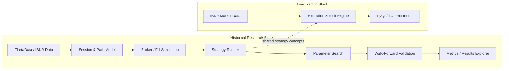

# Intraday Options Research Engine

A research and backtesting engine developed alongside a live same-day-expiry options trading system for same-day-expiry index options,
built from scratch over nearly a decade of tick data.

This repository contains the **research infrastructure** — the engine, its test
suite, and the methodology record. The strategies it was built to evaluate are
not included, and every parameter has been removed. What is here is the apparatus:
the part that had to be correct for any of the results to mean anything.

---

## Stack Overview



---

## Start here

**→ [`METHODOLOGY.md`](METHODOLOGY.md)** — the condensed research record. What the
engine had to express, which measurements turned out to be artefacts of the
measuring apparatus, which promising results died under a proper null, and the
production bugs that were only findable live. About a twenty-minute read; it is
the document this repository exists to support.

If you have five minutes instead of twenty, three findings from it:

- **The resolution of a backtest is set by how often the live engine *looks*, not
  by the granularity of the data it looks at.** The same reconstructed price path,
  read once a minute, reported roughly three times the daily P&L it reported when
  read every five seconds as the live engine actually reads it. That gap was
  larger than every strategy parameter in the study combined.
  ([§4.1](METHODOLOGY.md#41-the-resolution-of-a-backtest-is-set-by-how-often-the-live-engine-looks-not-by-the-granularity-of-the-data))

- **In five attempts, a per-bucket fitted parameter has never once beaten a single
  uniform constant out of sample** — and the fitting criterion does not have to be
  P&L for the selection bias to bite. Four different criteria were tried on one
  constant, including two that never touch the outcome at all. All four lost, and
  those two lost hardest. ([§4.2](METHODOLOGY.md#42-a-per-cell-argmax-has-never-once-survived-being-spent-out-of-sample))

- **`getattr(port, "book", None)` silently disabled every stop in the system for a
  full live session**, because the test fake had an attribute the real adapter did
  not. ([§6](METHODOLOGY.md#getattrobj-attr-none-turned-a-missing-interface-into-silent-absence-of-data))

---

## What's in here

```
lab/                    the backtesting engine (~5,800 lines) and its tests
lab/examples.py         two worked methods, so the engine has something to run
tools/                  the synthetic sample-data generator
explorer/               a browser tool for exploring exit policies
media/                  recordings of the live trading interfaces
```

**The engine knows only how to buy and sell options at strikes.** Every structure
is a composition of four verbs — `submit`, `close`, `close_all`, `settle`. No
strategy logic lives in it. That constraint is why a new study takes a day rather
than a week, and it is why this half of the codebase could be published while the
other half could not.

| module | owns |
|---|---|
| `session.py` | one expiry as dense `[minute, strike]` arrays; strike selection by price, delta or offset |
| `paths.py` | the resolution axis (bar / intra-minute / tick-reconstructed) and the tick grid |
| `fills.py` | the fill bracket and tick concession |
| `broker.py` | atomic orders, per-leg commissions, free settlement, full ledger |
| `indicators.py` | a dual-band metric set, on the index chart or a contract's own path |
| `sweep.py` | many parameter cells, one pass over the data |
| `metrics.py` | Sharpe, drawdown, and tail dependence |
| `validate.py` | walk-forward folds with a purge gap, Deflated Sharpe |
| `search.py` | Bayesian parameter search with a random control arm |

---

## Running it

```bash
python -m venv .venv && .venv/bin/pip install -e ".[dev]"
.venv/bin/pytest
```

```
Public research-engine suite: 293 passed / 12 production-data skips.
Combined research + private live-application suites: ~2,000 tests.
```

The first run takes about 35 seconds because it builds a **synthetic sample
dataset** — 500 sessions of option chains and index bars, in the layout the
engine expects. After that the suite runs in about three seconds.

The dataset is not committed. It is ~70 MB, it is fully determined by a seed,
and a 300-line generator is smaller than its own output, so the repository
ships `tools/make_sample_data.py` and builds the data on first use. It is
synthetic because the production panel comes from a commercial feed whose
licence does not permit redistribution — **nothing measured on it is a
statement about any real market.** What it reproduces on purpose is *shape*:
expiry decay, the tick grid, two-sided uncrossed quotes, a traded bar that sits
inside the quote, and a chain that carries a stale pre-rotation snapshot before
the book actually opens.

### The 12 skips are deliberate

They assert facts about the **production** dataset rather than about the
engine: its size, a session named by date, or a base rate of the real market.
The sample data cannot carry those and should not pretend to. Point the engine
at a real store and they run:

```bash
LAB_DATA_ROOT=/path/to/dataset .venv/bin/pytest
```

Everything else — fills, commissions, strike selection by price and by delta,
path reconstruction, band computation, walk-forward folds, the two independent
lookahead guards — runs against the sample data.

---

## Demos

Recordings of the live interfaces running in their built-in demo modes — synthetic
sessions on an accelerated clock, no broker connection:

- [**P&L explorer**](https://trigram777.github.io/intraday-options-research-engine/explorer/results/explorer.html) — a browser tool for exploring exit policies over a large panel of historical entries

- **QT Desktop Frontend**

  
- **Terminal Frontend**

  

---

## Scope and redaction

The research programme behind this is roughly 16,700 lines of maintained log
covering nine years of session data. This repository is deliberately a subset.

**Removed:** every strategy constant, all schedule times, the strike-selection
rules, and all absolute performance figures. **Kept:** the engine, the tests, the
methodology, and the failure post-mortems. Where a magnitude is load-bearing to a
methodological argument it appears as a ratio, which carries the argument and none
of the strategy.

Market data is not redistributed — the vendor licence does not permit it. Any
sample data included here is permuted or synthetic, and is labelled as such. The
demos are demonstrations of *software*, not of profitability.

Nothing here is investment advice or a solicitation, and no claim of
profitability is made or implied.

---

## Contact

C.L. Coleman :  [Email](mailto:github@hepteract.com)


<script type="module">
    Array.from(document.getElementsByClassName("language-mermaid")).forEach(element => {
      element.classList.add("mermaid");
    });
    import mermaid from 'https://cdn.jsdelivr.net/npm/mermaid@11/dist/mermaid.esm.min.mjs';
    mermaid.initialize({ startOnLoad: true });
</script>

